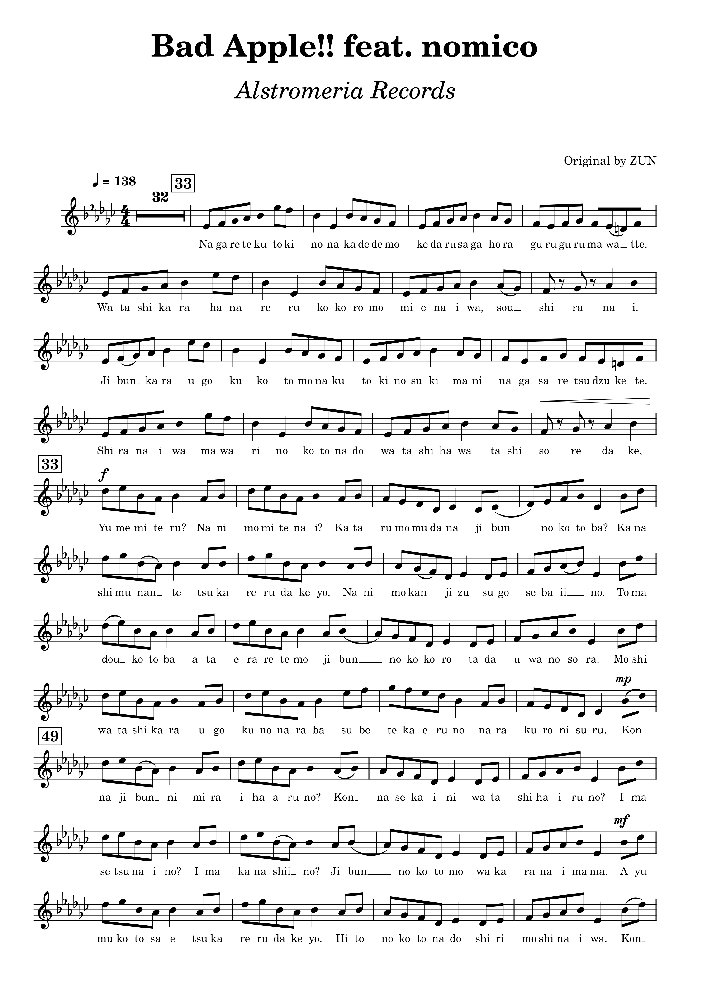
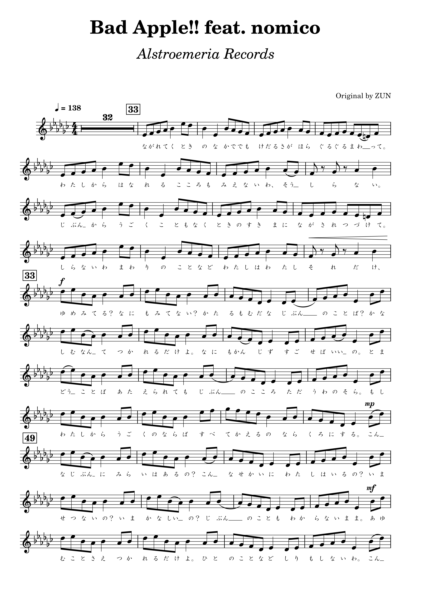

## Romaji2Hiragana plugin for MuseScore 3
Romaji2Hiragana is a plugin for MuseScore 3 which converts romaji lyrics like 'ra' and 'to' to 「ら」 and 「と」.

Makes kana lyric entry easier to work around MS3's issues with kana entry using a JP keyboard or EN keyboard with IME.

This version is forked from the original to add major improvements, since the original seems to be abandoned.

See also https://github.com/dragonwithafez/Romaji2Katakana for an equivalent tool for converting to katakana.

The plugin will preserve existing kana, both hiragana and katakana.

### Installation
Download the latest release from the Releases sidebar, or clone the repository. Unzip the downloaded files into MuseScore's Plugins folder, then open MuseScore, navigate to the Plugin Manager and check Romaji2Hiragana. If desired for space reasons, you may delete any files within the extracted directory except "Romaji2Hiragana.qml".

#### Uninstallation
Delete the Romaji2Hiragana folder from MuseScore's Plugins folder.

### Usage
Enter the romaji lyrics of your composition in MuseScore 3. Running the plugin will convert all lyrics written in the Latin alphabet within the current selection to their respective kana, preserving existing kana and punctuation.

For lyrics such as 「なった」 spread over two notes, they can be entered as either 'nat -ta' or 'na -tta', depending on whether you want 「なっ -た」 or 「な -った」.

### Limitations
「は」、「へ」、「を」 must be entered as 'ha', 'he', 'wo', regardless of pronunciation. Code can't read your mind :)

Diacritics are not supported; enter long vowels as double letters, i.e. 「もう」 should be entered as "mou" not "mō" or "mô".

Any non-Japanese lyrics using Latin characters in the current selection will be converted to kana with potentially unwanted results. Make sure any such lyrics are not selected when running the plugin.

As of version 1.2.1, the plugin no longer supports multiple romanizations of kana such as 'shi'/'si'-「し」、'dji'/'di'-「ぢ」、etc. Only one conversion per kana is supported. See https://github.com/dragonwithafez/Romaji2Hiragana/wiki/Conversion-table for current kana conversion table.

### Changelog

#### Changes in version 2.0.0 (pending release)
- Implement https://github.com/dragonwithafez/Romaji2Hiragana/issues/6 (Plugin no longer affects entire score)

#### Changes in version 1.2.1
- Remove alternate conversions of certain kana in preparation for next major update. See https://github.com/dragonwithafez/Romaji2Hiragana/wiki/Conversion-table for current kana conversion table
- Fix https://github.com/dragonwithafez/Romaji2Hiragana/issues/5
- Fix https://github.com/dragonwithafez/Romaji2Hiragana/issues/4

#### Changes in version 1.2.0
- Fix https://github.com/dragonwithafez/Romaji2Hiragana-Plugin/issues/3
- Fix issue with conversion of JP punctuation
- Cleaned up unnecessary files in repository

#### Changes in version 1.1.2
- Fix https://github.com/dragonwithafez/Romaji2Hiragana-Plugin/issues/1
- Fix https://github.com/dragonwithafez/Romaji2Hiragana-Plugin/issues/2

#### Changes in version 1.1.1
- Fixed issues with conversion of capital letters
- Added support for punctuation:
	- 。 (.)
	- 、 (,)
	- ？ (?)
	- _ (unchanged)

#### Changes in version 1.1.0
- Edited kana conversion list to fix incorrect conversion of certain kana
- Added single consonant-to-っ conversion
- Added alternate conversions for morae containing:
	- し (shi/si)
	- ち (chi/ti)
	- つ (tsu/tu)
	- ふ (fu/hu)
	- じ (ji/zi)
	- ぢ (dji/di)
	- づ (dzu/zu)
	- And all -ゃ　-ゅ　-ょ derivatives
- Plugin now processes whole lyric, allowing for polysyllabic lyrics such as 「なき」、「さあ」、「しかし」、etc.

#### Before and after using plugin
Before: 
After: 

